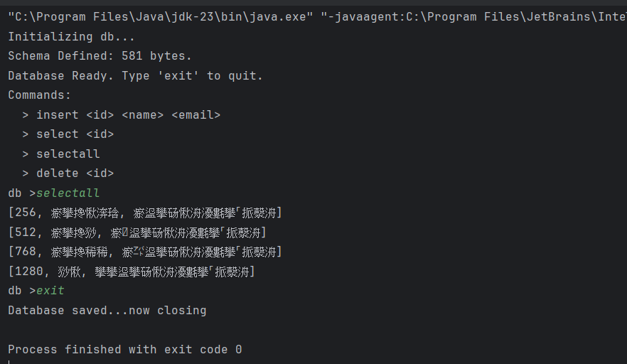
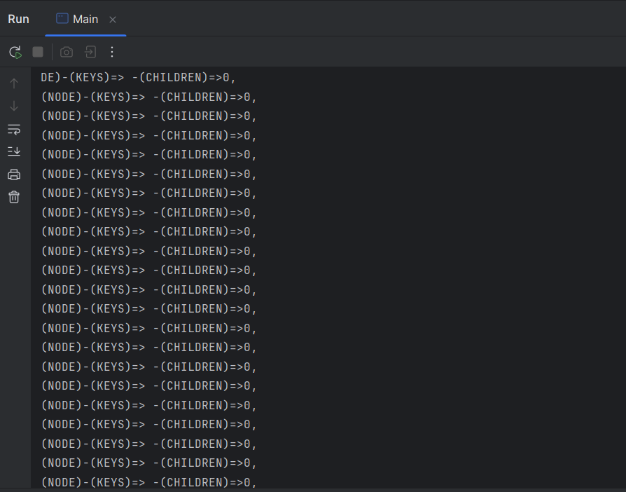

1>lol one byte change or something i did...

2> EOFF error

3>two same index deletion not happening...

[1-1-26]
Visualization / Null Pointers: Likely issues where the visualizer tried to render a node (like a Child or Leaf) that 
hadn't been initialized or loaded by the Pager yet.
(same caused due hardcoding root= page 2 on rerun)
Recursion Depth / Stack Overflow: If the visualizer tried to traverse a B-Tree with broken links (e.g., a node pointing 
to itself), it would loop infinitely.
(problem with root after exiting was going back to standard 2 else allocated root)

File Access / Stream Issues: Errors related to opening the .db file, specifically if the file was already open in 
another process or if the pointer logic was off.
(changed the method from the creatpage to directly allocating as it get marked dirty and overwrites the 0header metadata
for root)

[31-1-26]
noting much explicit just implementation failures
